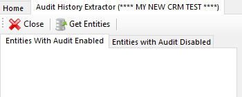
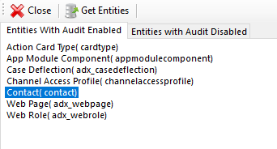
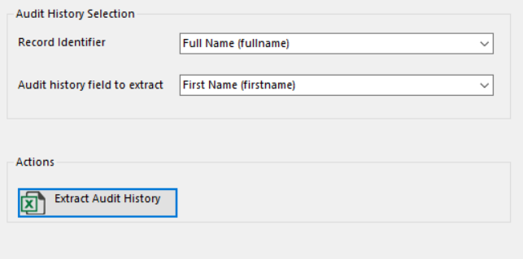
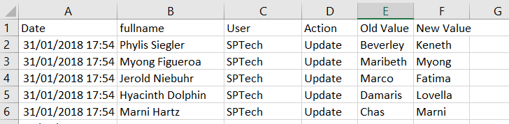

# Audit History Extractor
<ul>
  <li> Click "Get Entities" to get the list of all entities with Audit enabled or not. The list box will be filled with the entities list 
   
  </li>
  <li>Once you have the list ready select an entity from the list. You'll retrieve the Audit history for the selected entity.
     </li>
   <li>
Add your fetch XML to select the records that you want to extract the audit history for. Make sure you are using a Fetch XML for the same selected entity. Otherwise you'll get an error message. 
  
   <li>Once you have your FetchXML prepared, you have to select your record identifier / Primary Key and your field that you want to extract the Audit History for. 
   </li>
  </li>
   <li>In Action section click on "Extract Audit History"  and choose Location and File type ( Comma or Semicolon separated CSV file )
   
  </li>
     <li>As result you'll get an Excel in CSV format like the Screenshot below with all changes listed for the field with the old value and the new value displayed. 
  
   
</li>
 
</ul>
